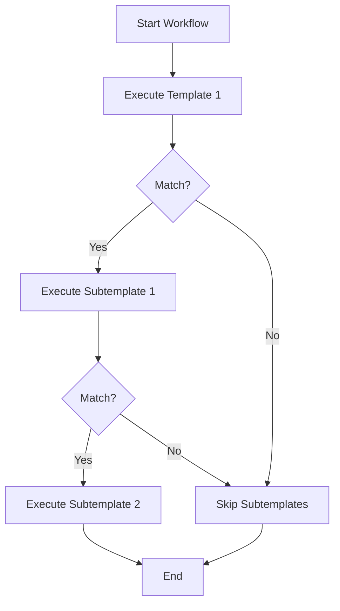

Workflows enable multi-step template execution with conditional logic, allowing you to chain multiple templates together based on the results of previous templates. They provide a powerful way to create complex vulnerability detection scenarios that require multiple steps.

## Basic workflow structure

Workflows are defined in a separate YAML file:

```yaml
id: workflow-example

info:
  name: Test Workflow Template
  author: pdteam
  severity: info

workflows:
  - template: templates/tech-detect.yaml
  - template: templates/wordpress-check.yaml
  - template: templates/wordpress-plugins.yaml
```

## Workflow components

<ParamField path="template" type="string" required>
  Path to the template file to execute (relative to nuclei-templates directory).
  
  ```yaml
  workflows:
    - template: http/tech-detect.yaml
  ```
</ParamField>

<ParamField path="tags" type="array">
  Execute all templates matching specified tags.
  
  ```yaml
  workflows:
    - tags:
        - wordpress
        - plugins
  ```
</ParamField>

<ParamField path="subtemplates" type="array">
  Templates to execute if the parent template matches.
  
  ```yaml
  workflows:
    - template: tech-detect.yaml
      subtemplates:
        - template: wordpress-plugins.yaml
  ```
</ParamField>

<ParamField path="matchers" type="array">
  Execute subtemplates based on specific matcher results.
  
  ```yaml
  workflows:
    - template: tech-detect.yaml
      matchers:
        - name: wordpress
          subtemplates:
            - template: wordpress-vulns.yaml
  ```
</ParamField>

## Simple workflows

<Tabs>
  <Tab title="Sequential">
    Execute templates one after another:

    ```yaml
    id: sequential-workflow
    
    info:
      name: Sequential Workflow
      author: pdteam
      severity: info
    
    workflows:
      - template: workflow/match-1.yaml
      - template: workflow/match-2.yaml
      - template: workflow/match-3.yaml
    ```
  </Tab>
  
  <Tab title="Tag-Based">
    Execute all templates with specific tags:

    ```yaml
    id: tag-workflow
    
    info:
      name: Tag-Based Workflow
      author: pdteam
      severity: info
    
    workflows:
      - tags:
          - wordpress
          - joomla
          - drupal
    ```
  </Tab>
</Tabs>

## Conditional workflows

Execute templates based on previous results:

```yaml
id: conditional-workflow

info:
  name: WordPress Vulnerability Detection
  author: pdteam
  severity: high

workflows:
  # Step 1: Detect if target is WordPress
  - template: wordpress-detect.yaml
    
    # Step 2: Only run if WordPress is detected
    subtemplates:
      # Check WordPress version
      - template: wordpress-version.yaml
      
      # Enumerate plugins
      - template: wordpress-plugins.yaml
        
        # Step 3: Only run if vulnerable plugins found
        subtemplates:
          - template: wordpress-plugin-exploits.yaml
```

## Matcher-based workflows

Execute different templates based on specific matcher results:

```yaml
id: matcher-workflow

info:
  name: Technology-Specific Checks
  author: pdteam
  severity: info

workflows:
  - template: tech-detect.yaml
    
    matchers:
      - name: wordpress-detected
        subtemplates:
          - template: wordpress-vulns.yaml
      
      - name: joomla-detected
        subtemplates:
          - template: joomla-vulns.yaml
      
      - name: drupal-detected
        subtemplates:
          - template: drupal-vulns.yaml
```

## Complex workflows

<CodeGroup>
```yaml Multi-Level Workflow
id: complex-workflow

info:
  name: Complex Multi-Level Workflow
  author: pdteam
  severity: high

workflows:
  # Level 1: Initial detection
  - template: workflow/match-1.yaml
    
    subtemplates:
      # Level 2: Deep inspection if match
      - template: workflow/nomatch-1.yaml
        
        subtemplates:
          # Level 3: Exploitation if vulnerable
          - template: workflow/match-2.yaml
  
  # Parallel execution path
  - template: workflow/match-3.yaml
  
  # Another conditional path
  - template: workflow/match-2.yaml
    matchers:
      - name: test-matcher
        subtemplates:
          - template: workflow/nomatch-1.yaml
            subtemplates:
              - template: workflow/match-1.yaml
```

```yaml CMS Detection Workflow
id: cms-detection-workflow

info:
  name: CMS Detection and Exploitation
  author: pdteam
  severity: critical

workflows:
  # Detect CMS type
  - template: http/cms-detection.yaml
    
    matchers:
      # WordPress path
      - name: wordpress
        subtemplates:
          - template: wordpress/wp-version.yaml
          - template: wordpress/wp-users-enum.yaml
          - template: wordpress/wp-plugins-enum.yaml
            subtemplates:
              - template: wordpress/wp-plugin-vulns.yaml
      
      # Joomla path
      - name: joomla
        subtemplates:
          - template: joomla/joomla-version.yaml
          - template: joomla/joomla-config-exposure.yaml
      
      # Drupal path
      - name: drupal
        subtemplates:
          - template: drupal/drupal-version.yaml
          - template: drupal/drupalgeddon2.yaml
```
</CodeGroup>

## Workflow execution flow



## Value sharing between templates

Workflows can share extracted values between templates:

<CodeGroup>
```yaml Workflow File
id: http-value-sharing-workflow

info:
  name: HTTP Value Sharing Test
  author: pdteam
  severity: info

workflows:
  - template: workflow/http-value-share-template-1.yaml
    subtemplates:
      - template: workflow/http-value-share-template-2.yaml
```

```yaml Template 1 (Extract)
id: template-1

info:
  name: Extract Value
  author: pdteam
  severity: info

http:
  - method: GET
    path:
      - "{{BaseURL}}/api/token"
    
    extractors:
      - type: regex
        name: api_token
        internal: true
        regex:
          - "token=([a-zA-Z0-9]+)"
```

```yaml Template 2 (Use)
id: template-2

info:
  name: Use Extracted Value
  author: pdteam
  severity: info

http:
  - method: GET
    path:
      - "{{BaseURL}}/api/data"
    headers:
      Authorization: "Bearer {{api_token}}"
```
</CodeGroup>

## Multi-protocol workflows

Combine different protocol types in workflows:

```yaml
id: multi-protocol-workflow

info:
  name: Multi-Protocol Workflow
  author: pdteam
  severity: info

workflows:
  # DNS reconnaissance
  - template: dns/dns-recon.yaml
    subtemplates:
      # HTTP probing
      - template: http/http-probe.yaml
        subtemplates:
          # Network service detection
          - template: network/service-detect.yaml
```

## Real-world examples

<CodeGroup>
```yaml WordPress Security Audit
id: wordpress-security-audit

info:
  name: Complete WordPress Security Audit
  author: pdteam
  severity: high

workflows:
  - template: wordpress/wp-detect.yaml
    
    subtemplates:
      # Information gathering
      - template: wordpress/wp-version.yaml
      - template: wordpress/wp-debug-log.yaml
      - template: wordpress/wp-config-backup.yaml
      
      # User enumeration
      - template: wordpress/wp-user-enum.yaml
        
        subtemplates:
          # Brute force if users found
          - template: wordpress/wp-login-brute.yaml
      
      # Plugin detection
      - template: wordpress/wp-plugins-enum.yaml
        
        subtemplates:
          # Check for vulnerable plugins
          - tags:
              - wordpress-plugin
              - cve
```

```yaml Subdomain Takeover Detection
id: subdomain-takeover-workflow

info:
  name: Subdomain Takeover Detection
  author: pdteam
  severity: high

workflows:
  # DNS enumeration
  - template: dns/cname-detect.yaml
    
    matchers:
      - name: vercel
        subtemplates:
          - template: takeovers/vercel-takeover.yaml
      
      - name: heroku
        subtemplates:
          - template: takeovers/heroku-takeover.yaml
      
      - name: azure
        subtemplates:
          - template: takeovers/azure-takeover.yaml
```

```yaml API Security Testing
id: api-security-workflow

info:
  name: API Security Testing Workflow
  author: pdteam
  severity: high

workflows:
  # Discover API endpoints
  - template: api/api-discovery.yaml
    
    subtemplates:
      # Test authentication
      - template: api/api-auth-bypass.yaml
      
      # Test for common vulnerabilities
      - template: api/api-injection.yaml
      - template: api/api-idor.yaml
      - template: api/api-rate-limit.yaml
      
      # Check for sensitive data exposure
      - template: api/api-sensitive-data.yaml
```
</CodeGroup>

## Workflow vs flow

<Tabs>
  <Tab title="Workflows">
    **Best for:**
    - Multi-template orchestration
    - Technology-specific checks
    - Modular template organization
    - Community template reuse
    
    **Limitations:**
    - Separate file required
    - Less flexible than flow
    - No custom logic
  </Tab>
  
  <Tab title="Flow">
    **Best for:**
    - Complex conditional logic
    - Custom orchestration
    - Iterating over extracted values
    - Single template with multiple steps
    
    **Advantages:**
    - JavaScript-based logic
    - No separate file needed
    - Full control over execution
  </Tab>
</Tabs>

## Best practices

1. **Organize by purpose** - Group related templates in workflows
2. **Use descriptive names** - Name workflows and matchers clearly
3. **Minimize depth** - Avoid deeply nested workflows (max 3-4 levels)
4. **Share values efficiently** - Use internal extractors for template communication
5. **Handle failures gracefully** - Design workflows to continue if individual templates fail
6. **Test thoroughly** - Verify workflow execution paths with different targets
7. **Document dependencies** - Comment on template relationships and required data
8. **Consider performance** - Limit the number of templates in high-frequency workflows

## Execution control

<ParamField path="stop-at-first-match" type="boolean" default="false">
  Stop workflow execution after first successful match (set on individual templates).
</ParamField>

<Warning>
  Workflows execute templates sequentially. If a parent template doesn't match, its subtemplates are skipped. Design workflows to handle both match and no-match scenarios.
</Warning>

## Common patterns

### Technology stack detection

```yaml
workflows:
  - template: tech-detect.yaml
    matchers:
      - name: php
        subtemplates:
          - tags: [php]
      - name: nodejs
        subtemplates:
          - tags: [nodejs]
      - name: python
        subtemplates:
          - tags: [python]
```

### Progressive exploitation

```yaml
workflows:
  - template: recon.yaml
    subtemplates:
      - template: vulnerability-scan.yaml
        subtemplates:
          - template: exploitation.yaml
            subtemplates:
              - template: post-exploitation.yaml
```

### Parallel checks

```yaml
workflows:
  - template: check-1.yaml
  - template: check-2.yaml
  - template: check-3.yaml
  # All execute regardless of previous results
```

## Related

<CardGroup cols={2}>
  <Card title="Flow Control" icon="code-branch" href="/templates/flow-control">
    JavaScript-based orchestration
  </Card>
  <Card title="Matchers" icon="check-circle" href="/templates/matchers">
    Conditional execution
  </Card>
  <Card title="Extractors" icon="filter" href="/templates/extractors">
    Value sharing
  </Card>
  <Card title="Variables" icon="dollar-sign" href="/templates/variables">
    Template context
  </Card>
</CardGroup>